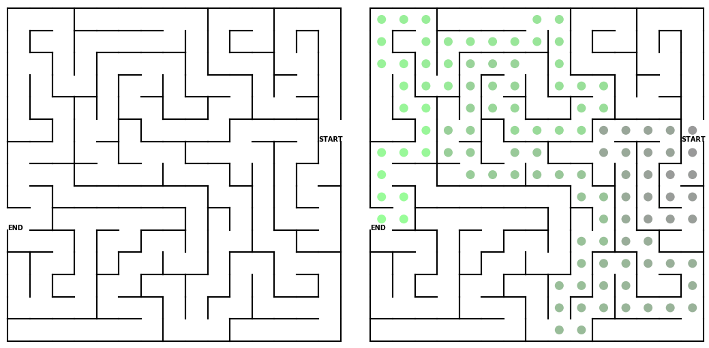

# Maze generator and solver
Python scripts for generating random solvable mazes using the depth-first search and recursive backtracking algorithms. The code also implements a recursive backtracking pathfinding algorithm for solving the generated mazes. Here is an example of a generated maze and its computed solution.  

  

  
Both the generator and solver algorithm uses recursive backtracking and here an example of the latter can be seen. Cells indicated in light orange are part of the backtracking.  
The algorithms works by moving randomly from a cell to one of its unvisited neighbours. If the search reaches cell which have no unvisited neighbours, the search backtracks until it moves to a cell with unvisited neighbours. The generator algorithm is heavily inspired by the psuedo-code provided by [Wikipedia](https://en.wikipedia.org/wiki/Maze_generation_algorithm). The main difference between the generator and solver algorithms are in the fact that, when solving the maze, one has to take into account not being able to move through walls. And thus proper pathfinding needs to be implemented. There's also impmeneted an ehnaced version of the solver algorithm which moves not to a random neighbour, but moves to the neighbour that minimizes the distance sqrt(x^2 + y^2) to the exit cell (final destination).